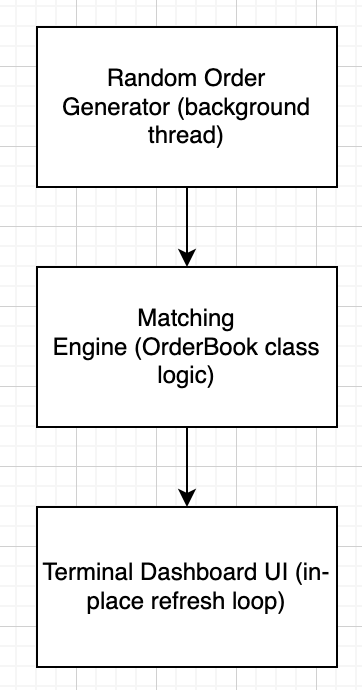

# 1. Introduction

This project implements a Continuous Limit Order Book (CLOB) in C++, simulating how modern electronic exchanges match buy and sell orders in real time.
The system continuously generates random buy and sell orders, processes them through a matching engine, and displays a real-time terminal dashboard that updates in place without flicker—similar to a professional trading terminal.

The project highlights:

- Priority queue–based order handling

- Price–time priority matching logic

- Real-time, in-place terminal UI

- Multithreaded simulation (order generation + UI refresh)

- Clean separation between order book logic and rendering

Use of modern C++ features (C++17)

# 2. Research on Stock Exchanges

Modern stock exchanges such as NASDAQ, NYSE, and most crypto exchanges use a Continuous Limit Order Book as their core mechanism for determining market prices.

How a CLOB Works

A CLOB stores all open buy and sell limit orders:

- Buy (bid) orders sorted by highest price first, then earliest timestamp

- Sell (ask) orders sorted by lowest price first, then earliest timestamp

When a new order arrives, it is matched against the best available opposing orders:

- A buy order matches with the lowest ask

- A sell order matches with the highest bid

This ensures:

- Price priority: Better prices get executed first.

- Time priority: Earlier orders at the same price are executed first.

- Transparency: Anyone can see market depth (best prices + volumes).

Fair execution: No trader is given unfair priority.

CLOBs enable:

- High-frequency trading

- Real-time price discovery

- Transparency into market depth

- Continuous matching (millisecond-level)

Our implementation is inspired by real-world systems like the Island ECN, one of the earliest and most influential electronic limit order books.

# 3. Software Design and Implementation

## 3.1 Architecture Overview


## 3.2 Key Data Structures
Order:
```cpp
struct Order {
    uint64_t id;
    Side side;
    double price;
    uint64_t qty;
    uint64_t ts;
};
```
Priority queues:

The order book uses two std::multisets:

```cpp
std::multiset<Order, BuyCmp> buys;   // highest price first
std::multiset<Order, SellCmp> sells; // lowest price first
```

## 3.3 Matching Engine

The core logic is implemented in:

```cpp
uint64_t OrderBook::post_limit_order(Side side, double price, uint64_t qty);
```


This function:

- Matches it against opposing orders.

- Executes trades (partial fills allowed).

- Removes or adjusts matched orders.

- Records trades for UI display.

- Matching logic for BUY orders (simplified):


Matching logic for BUY orders (simplified):

```cpp
while (incoming.qty > 0 && bestSell.price <= incoming.price) {
    execute trade
    reduce quantities
    remove/replace matched order
}
```

## 3.4 Real-Time Terminal Dashboard

The dashboard updates in place using ANSI escape sequences:

```cpp
static const char* MOVE_HOME = "\033[H";   // move cursor to top
std::cout << "\033[2J";                    // clear once at startup
```


On each refresh:

- Move cursor to top of screen

- Overwrite the entire UI

- Print buy levels (green)

- Print sell levels (red)

- Print recent trades (yellow)

## 3.5 Multithreading

The project uses two threads:

- Producer thread

- Continuously generates random buy/sell orders

- Slightly shifts the market midpoint

- Mimics real market flows

Main/UI thread

- Refreshes the order book display in the terminal

- Interval: ~250 ms

- Flicker-free due to in-place updating

## 3.6 Code Snippet: Rendering
```cpp
void render(OrderBook &ob) {
    std::cout << MOVE_HOME;

    auto buys = ob.top_buys(10);
    auto sells = ob.top_sells(10);
    auto trades = ob.recent_trades(10);

    std::cout << "Continuous Limit Order Book (CLOB)\n\n";

    for (...) {
        std::cout << GREEN << buys[i].price << RESET;
        std::cout << RED   << sells[i].price << RESET;
    }
}
```

# 4. How to Build and Run
**Requirements:**

- g++ with C++17 or later
- make


**Steps:**

Compile:

```bash
make
```

Run the program:

```bash
make run
```


Clean compiled files:

```bash
make clean
```

The dashboard updates live until the program is stopped (Ctrl + C).

# 5. Conclusions and Learnings

**Joël**

I learned how real-world exchanges implement price-time priority and how surprisingly complex matching engines are behind the scenes. Implementing the CLOB from scratch deepened my understanding of data structures, especially how multiset ordering can model real exchange mechanics. I also learned how to create a real-time terminal UI without flickering, which makes the system feel much more like a real trading dashboard.